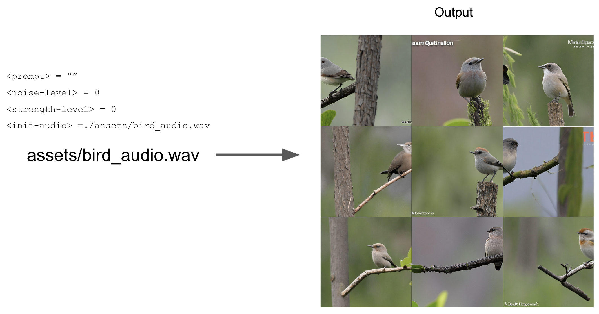
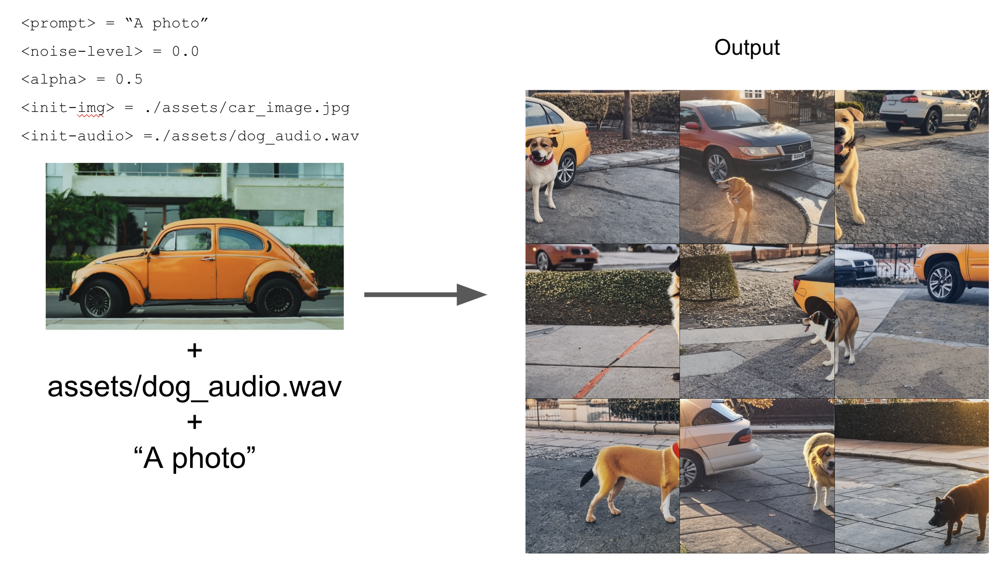
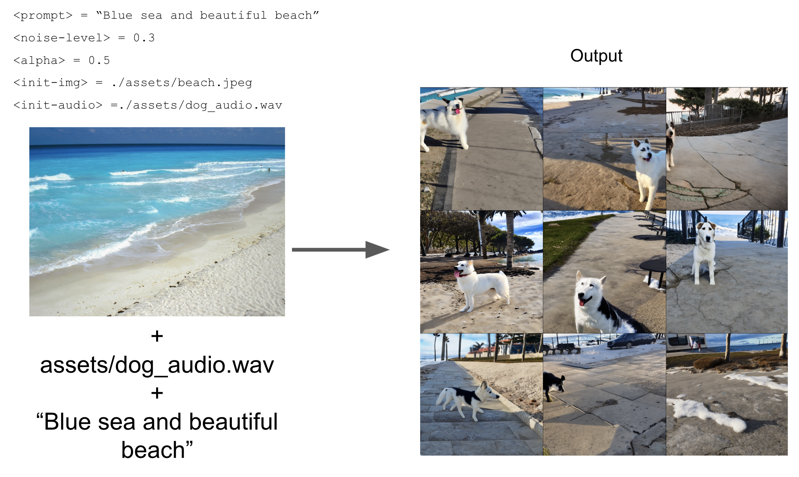

# BindDiffusion: One Diffusion Model to Bind Them All
Inspired by the recent progress in multimodality learning ([ImageBind](https://github.com/facebookresearch/ImageBind)), we explore the idea of using one single diffusion model for multimodality-based image generation. Noticeably, we leverage a pre-trained diffusion model to comsume conditions from diverse or even mixed modalities.
This design allows many novel applications, such as audio-to-image, without any additional training. This repo is still under development. Please stay tuned!

Acknowledgement: This repo is based on the following amazing projects: [Stable Diffusion](https://github.com/Stability-AI/stablediffusion),
[ImageBind](https://github.com/facebookresearch/ImageBind).


### Install
``` bash
pip install -r requirements.txt
```

### Pretrained checkpoints
```
cd checkpoints;
wget https://huggingface.co/stabilityai/stable-diffusion-2-1-unclip/blob/main/sd21-unclip-h.ckpt;
wget https://dl.fbaipublicfiles.com/imagebind/imagebind_huge.pth;
```

### [An Jupyter Notebook for beginners](./audio2image.ipynb)

### Image-conditioned generation:
```
python main_bind.py --prompt <prompt> --device cuda --modality image \
--H 768 --W 768 \ 
--config ./configs/stable-diffusion/v2-1-stable-unclip-h-bind-inference.yaml \
--ckpt ./checkpoints/sd21-unclip-h.ckpt \
--noise-level <noise-level> --init <init-img> --strength <strength-level>
```


### Audio-conditioned generation:
```
python main_bind.py --prompt <prompt> --device cuda --modality audio \
--H 768 --W 768 \
--config ./configs/stable-diffusion/v2-1-stable-unclip-h-bind-inference.yaml \
--ckpt ./checkpoints/sd21-unclip-h.ckpt \
--strength <strength-level> --noise-level <noise-level> --init <init-audio>
```



### Naive mixed-modality generation:
```
python main_multi_bind.py --prompt <prompt> --device cuda \
--H 768 --W 768 \
--config ./configs/stable-diffusion/v2-1-stable-unclip-h-bind-inference.yaml \
--ckpt ./checkpoints/sd21-unclip-h.ckpt \
--noise-level <noise-level> --init-image <init-img> --init-audio <init-audio> \
--alpha <alpha>
```






### Contributors
We welcome contributions and suggestions from anyone interested in this fun project!

Feel free to explore the profiles of our contributors:
- [Zhijie Lin](https://github.com/ikuinen)
- [Lijuan Liu](https://github.com/xyyeah) 
- [Yangzihao Wang](https://github.com/yzhwang)
- [Xiangyu Xu](https://github.com/xuxy09)

We appreciate your interest and look forward to your involvement!